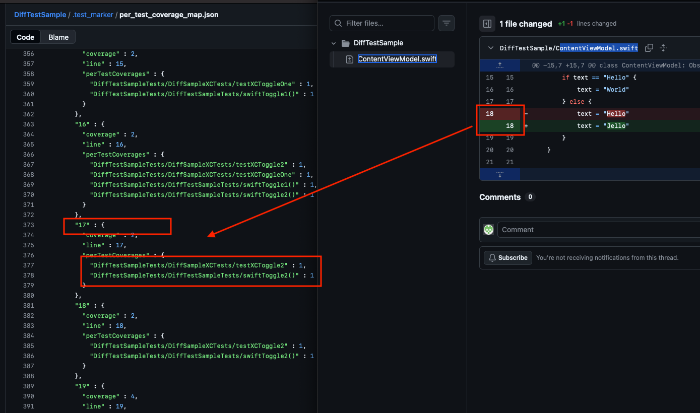

# diffTest
## scalable unit testing:
when project is getting longer and test code is getting stacked, test code is getting longer and longer.basically it is not really scalable. how can we solve this issue?

If we use code coverage and diff together we can make it work
- collect code coverage of each individual test
- we need to `Mark` the code coverage and code as one set
- we need to diff changes and compare with `Mark`ed coverage
- there is a change in `covered` code for specific test meaning we have to run that test
- there is no change in `covered` code for specific test meaning we don't need to run the test

## How to use
difftest mark path-to-xcodeProject : (assume git repo is in same dir) 
  commit the test marking
difftest test path-to-xcodeProject : 
  diff with the marking, and test only the test that is broken

(for now)
1. make any change and commit in DiffTestSample project

2. Mark
open edit scheme 
diffTest/ run/ argument tab
add below 2 arguments
- "test"
- "--root /Users/albertqpark/code/DiffTest/DiffTestSample"
run diffTest target will mark 

this will generate file and commit this in to the repo
https://github.com/albert-qjinp-queuez/DiffTestSample/blob/testRun/.test_marker/per_test_coverage_map.json

3. Diff Test
open edit scheme 
diffTest/ run/ argument tab
add below 2 arguments
- "mark"
- "--root /Users/albertqpark/code/DiffTest/DiffTestSample"
run diffTest target will mark 

DiffTestSample will do the "diff testing" against marking

- as you can see acutal line-number 18 in the code is in the line-index 17 in the marking (0 starting index)

### Limitation
some code change will not break the previous test coverages but alter them.
  - overriding function will alter the coverage without breaking previous code  

## Mile Stone TODO
### TODO until v1.0.0
  - easy way to install : may be homebrew?
  - check not only Sample Code but in real situations
  - apply test-without-build
  - more optimization - reduce temp file handover; change it to more direct object hand overs

### TODO until v2.0.0
  - marking during diff test? : mostly possible, but more to investigate

### back log TODO
  - DiffTestSample/.gitattributes to be binary then current approach
  - make version printing system, make integral versioning
  - not do the command line testing but make and insert test-suite into xcode so that xcode interaction possible, able to see code coverage in xcode and coverage reports in xcode

## STEP to make it work
- `Mark`
  1. with clean commited code, (build for testing)
  2. run the full-unit test (test without build)
  3. from full-unit test collect all existing test functions
  4. for each individual test functions, run test with code coverage (test without build)
  5. convert and combine `(all individual test > code coverage)` into `(code line > covered by test functions)`
    - be aware perTestCoverageMap.json is generated based on slather reports line coverage count array, line is line Index, not line Number
      line Index starts from 0, different from regular line Number that will start from 1 
  6. commit `(code line > covered by test function)` with  `diffMark` tag

- `diffTest`
  1. when new code change happens collect  with `diffMark` tag
  2. check `(code line > covered by test function)` 
    if some line that is covered by test functions, run those tests only

## Usage
mostly thinking running this as below cases :
- `Mark`ing happens in server-side CI like Jenkins machine and `diffTest` will do in engineers local machine
- `Mark`ing happens in server-side CI like Jenkins machine per long-time-period and  `diffTest` will be running on each PR or short-time-period
- not only UnitTesting but also UITesting can do the same thing, and it will help much more while it is more time consuming tasks there.
